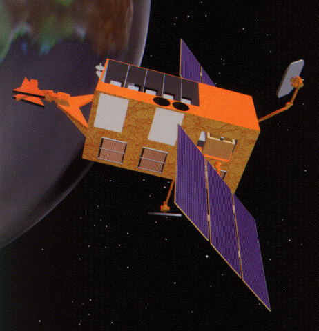
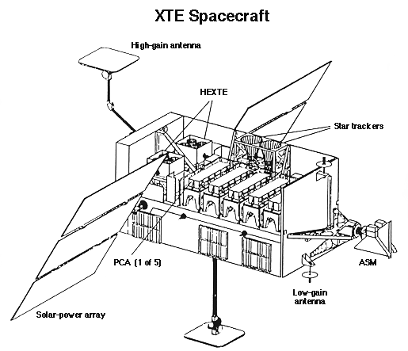

.. _gdt-rxte:

*******************************************************
Welcome to RXTE ASM Gamma-ray Data Tools Documentation!
*******************************************************

The RXTE ASM Gamma-ray Data Tools (GDT) is a toolkit for RXTE ASM data built on the 
:external:ref:`GDT Core Package<gdt-core>` and builds upon the 
`Fermi GBM Data Tools <https://fermi.gsfc.nasa.gov/ssc/data/analysis/gbm/gbm_data_tools/gdt-docs>`_. 

The Rossi X-ray Timing Explorer (RXTE) was launched on December 30, 1995 and contains
three intruments. The all-sky monitor (ASM) for which this softare has been developed, consisted of
three scanning shadow cameras with proportional counters for a total collecting area of 90 sq cm.
Each camera had a 6x90 deg field of view. The ASM covered the 2-10 keV energy range and viewed 80%
of the sky every 90 minutes. RXTE also contained two pointed instruments, the Proportional Counter
Array (PCA, 2-60 keV) and the High Energy X-ray Timing Experiment (HEXTE, 15-250 keV), which are
not incldued in the current version of this software package. RXTE was decommissioned on Jan 5,
2012.

.. rubric:: Citing

If you use the RXTE ASM Gamma-ray Data Tools in your research and publications, 
we would definitely appreciate an appropriate acknowledgment and citation! We 
suggest the following BibTex:

::

 @misc{GDT-rxte,
       author = {Colleen A. Wilson-Hodge and Adam Goldstein and William H. Cleveland and Daniel Kocevski},
       title = {RXTE ASM Gamma-ray Data Tools: v2.0.0},
       year = 2024,
       url = {https://github.com/USRA-STI/gdt-rxte}
 }
 

.. rubric:: Additional Resources
 
The RXTE Guest Observer Facility is a fantastic resource for all things RXTE.
Specifically, for the two pointed instruments (PCA and HEXTE), detailed analysis steps can 
be found `here <https://heasarc.gsfc.nasa.gov/docs/xte/xhp_proc_analysis.html>`_.  For RXTE ASM,
light curves for monitored sources and documentation can be found here  
`MIT ASM pages <http://xte.mit.edu>`_.

.. rubric:: Acknowledgments

The creation of the RXTE ASM Gamma-ray Data Tools were funded by the NASA's Astrophysics Data Analysis Program
(ADAP) via grant number 80NSSC21K0651.
Dr. Ron Remillard (MIT) provided the RXTE ASM camera light curve files and advised us on their usage for
the RXTE ASM Gamma-ray Data tools.

***************
Getting Started
***************
.. toctree::
   :maxdepth: 1

   install

******************
User Documentation
******************

RXTE ASM Definitions
=================
.. toctree::
   :maxdepth: 1

   missions/rxte/asm/time
   missions/rxte/asm/missiontable
   missions/rxte/asm/phaii

*******
License
*******
.. toctree::
   :maxdepth: 1
   
   license

Indices and tables
==================

* :ref:`genindex`
* :ref:`modindex`
* :ref:`search`
