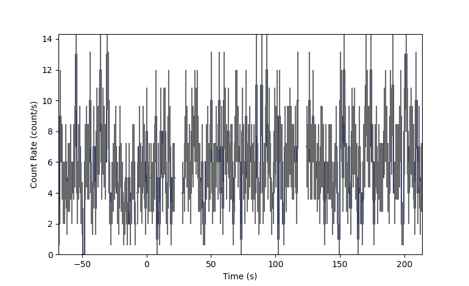

.. _rxte-phaii:

**********************************************************
RXTE ASM PHAII Data (:mod:`gdt.missions.rxte.phaii`)
**********************************************************
The primary science data available for RXTE ASM are count rate data in 1 second bins
in three energy bands (1.5-3, 3-5,and 5-12 keV) for each of three scanning shadow 
cameras (ssc1, ssc2, and ssc3) stored as ascii text files. Each file contains an
RXTE ASM dwell, approximately 90 seconds of data, for the three cameras in the three
energy bands. These data can be read into a phaii class using the open_fits method 
to allow all the phaii functionality from gdt.core to be used, for example making 
light curves, rebinning, etc. The RXTE ASM data can be written to a simple fits file
that can be read back into a phaii class using the open_fits method.

First we need to find the desired data. This is also described in the docs file for
gdt.missions.rxte.mission table.

First we read in the RXTE ASM mission table
    >>> from gdt.missions.rxte.asm.missiontable import RXTEMissionTable
    >>> asm_table_data = RXTEMissionTable.open()
    RXTEMissionTable read complete
        
Next we select a time you are interested in, for example a trigger time from RXTE or 
another mission    
    >>> from gdt.missions.rxte.asm.time import Time
    >>> time = Time("1997-08-15T12:07:04")
    >>> t0 = time.rxte
    

Next we find the file corresponding to that time:
    >>> dwell_file = RXTEMissionTable.get_dwell_file(t0)
    >>> print (dwell_file)
    /camera_data/cam_dwasc_02/amts114262324.21

Now we are ready to fill the phaii class with the data:
    >>> from gdt.missions.rxte.asm.phaii import RxtePhaiiNoHeaders
    >>> phaii_ssc1_970815_dw21 = RxtePhaiiNoHeaders.open_ascii(dwell_file,"ssc1",t0)
    >>> phaii_ssc2_970815_dw21 = RxtePhaiiNoHeaders.open_ascii(dwell_file,"ssc2",t0)
    >>> phaii_ssc3_970815_dw21 = RxtePhaiiNoHeaders.open_ascii(dwell_file,"ssc3",t0)

At this point we could make a light curve, plot the data, or write out the data. For
this example, we will read in two more dwells and merge the data before plotting so
that we have about 270 seconds of data.

Read in the next dwell (t0+90s):
    >>> dwell_file2 = RXTEMissionTable.get_dwell_file(t0+90,<path to rxte data>')
    >>> phaii_ssc1_970815_dw22 = RxtePhaiiNoHeaders.open_ascii(dwell_file2,"ssc1",t0)
    >>> phaii_ssc2_970815_dw22 = RxtePhaiiNoHeaders.open_ascii(dwell_file2,"ssc2",t0)
    >>> phaii_ssc3_970815_dw22 = RxtePhaiiNoHeaders.open_ascii(dwell_file2,"ssc3",t0)

Read in a 3rd dwell:
    >>> dwell_file3 = RXTEMissionTable.get_dwell_file(t0+180,<path to rxte data>')
    >>> phaii_ssc1_970815_dw23 = RxtePhaiiNoHeaders.open_ascii(dwell_file3,"ssc1",t0)
    >>> phaii_ssc2_970815_dw23 = RxtePhaiiNoHeaders.open_ascii(dwell_file3,"ssc2",t0)
    >>> phaii_ssc3_970815_dw23 = RxtePhaiiNoHeaders.open_ascii(dwell_file3,"ssc3",t0)

Now we can merge the three dwells:
    >>> phaii_ssc1_dw21to23 = RxtePhaiiNoHeaders.merge([phaii_ssc1_970815_dw21,phaii_ssc1_970815_dw22,phaii_ssc1_970815_dw23])
    >>> phaii_ssc2_dw21to23 = RxtePhaiiNoHeaders.merge([phaii_ssc2_970815_dw21,phaii_ssc2_970815_dw22,phaii_ssc2_970815_dw23])
    >>> phaii_ssc3_dw21to23 = RxtePhaiiNoHeaders.merge([phaii_ssc3_970815_dw21,phaii_ssc3_970815_dw22,phaii_ssc3_970815_dw23])

Next we can plot light curves for each of the cameras. Here we are plotting the 
light curve integrated over all three energy channels:
    >>> import matplotlib.pyplot as plt
    >>> from gdt.core.plot.lightcurve import Lightcurve

We make a plot for SSC1.    
    
    >>> lcplot = Lightcurve(phaii_ssc1_dw21to23.to_lightcurve())
    >>> plt.show()

This plot shows the count rates from t0 to t0+180s for SSC1

Next we plot data for SSC2 

    >>> lcplot = Lightcurve(phaii_ssc2_dw21to23.to_lightcurve())
    >>> plt.show()

This plot shows the count rates from t0 to t0+180 for SSC1    

.. image:: phaii_figs/phaii_ssc1_fig2.png

Lastly we plot data for SSC3.

    >>> lcplot = Lightcurve(phaii_ssc3_dw21to23.to_lightcurve())
    >>> plt.show()

This plot shows the count rates from t0 to t0+180 for SSC2. We can see that SSC2 does not detect the GRB.    

Since reading in the RXTE ASM mission table and the many ascii files tends to be
slow, we can write out our merged data to a fits file for later use.

    >>> RxtePhaiiNoHeaders.write(phaii_ssc1_dw21to23,directory='<my directory>',filename='test_rxte_phaii_ssc1_dw21to23.phaii',overwrite="True")
    >>> RxtePhaiiNoHeaders.write(phaii_ssc2_dw21to23,directory='<my_directory>',filename='test_rxte_phaii_ssc2_dw21to23.phaii',overwrite="True")
    >>> RxtePhaiiNoHeaders.write(phaii_ssc3_dw21to23,directory='<my_directory>',filename='test_rxte_phaii_ssc3_dw21to23.phaii',overwrite="True") 

We can read that data back in now or at a later time using the open_fits method:

    >>> new_test1 = RxtePhaiiNoHeaders.open_fits('<my directory>/test_rxte_phaii_ssc1_dw21to23.phaii',"ssc1",t0) 
    >>> new_test2 = RxtePhaiiNoHeaders.open_fits('<my directory>/test_rxte_phaii_ssc2_dw21to23.phaii',"ssc2",t0) 
    >>> new_test3 = RxtePhaiiNoHeaders.open_fits('<my directory>/test_rxte_phaii_ssc3_dw21to23.phaii',"ssc3",t0) 
    

See :external:ref:`Plotting Lightcurves<plot-lightcurve>` and 
:external:ref:`Plotting Count Spectra<plot-spectrum>` for more on
how to modify these plots.

For more details about working with PHAII data, see 
:external:ref:`PHAII Files<core-phaii>`.
 
Reference/API
=============

.. automodapi:: gdt.missions.rxte.asm.phaii
   :inherited-members:

